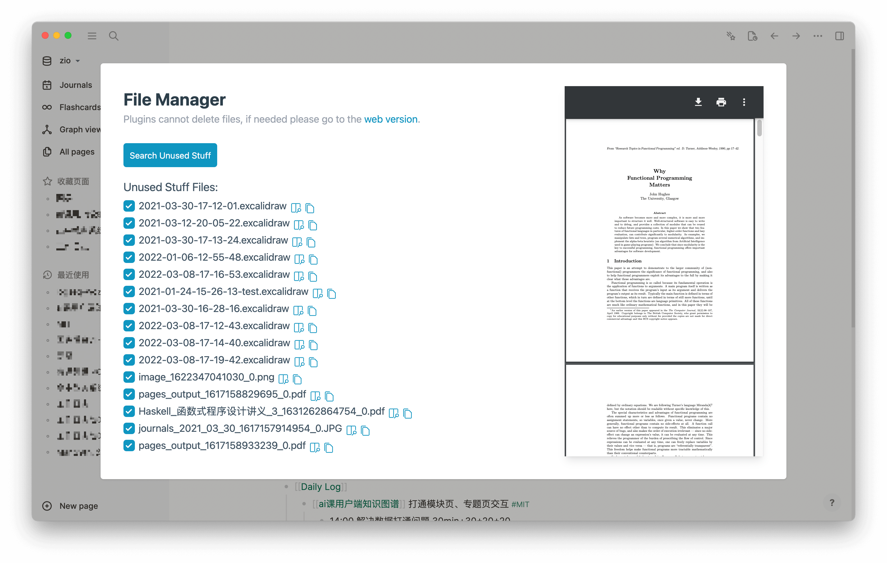
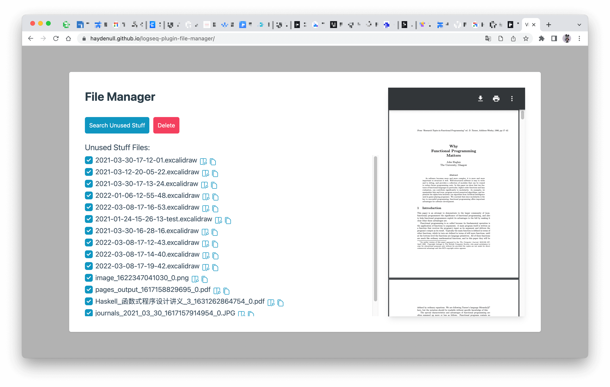

# logseq-plugin-file-manager
> Search files from assets and draws but not used in journals or pages.

**Please backup files before operation**

## Demo
### logseq plugin

### browser

## Usage
1. Install plugin
2. Click on the plugin icon in the logseq toolbar
3. Click `Search Unused Stuff` button and select the directory of your logseq graph
